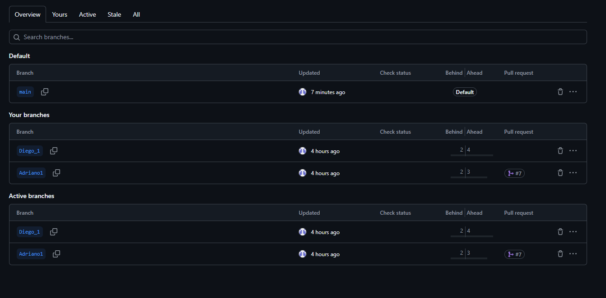
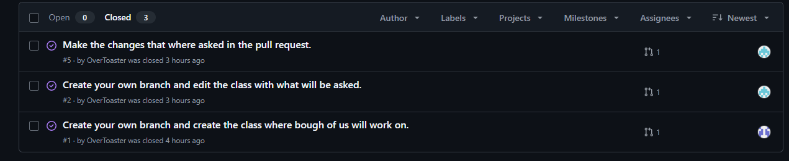
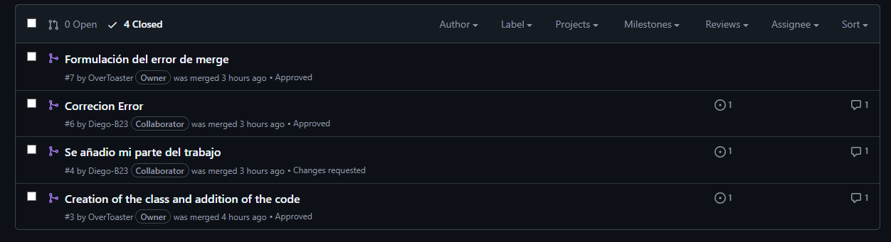
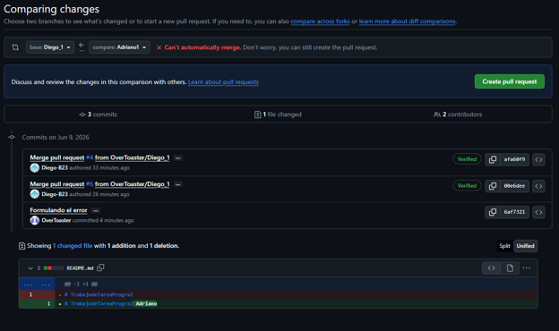
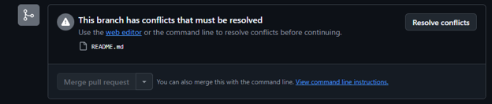
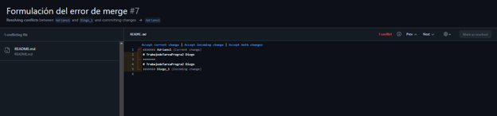
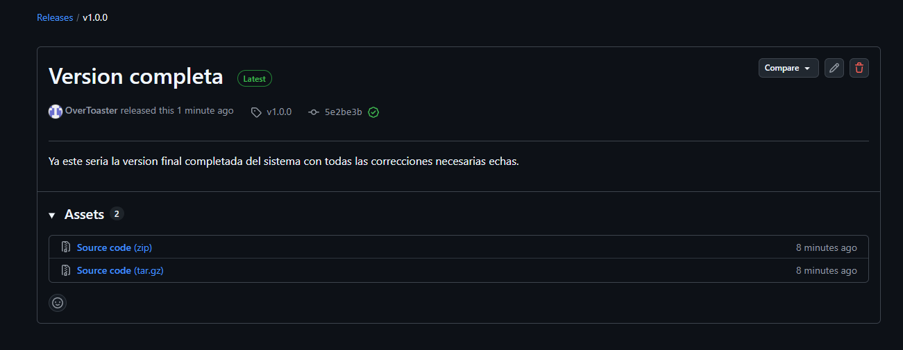
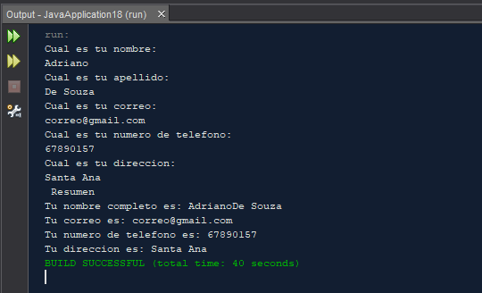

# TrabajodeTareaProgra2

Sistema de consola desarrollado en Java que recopila información básica del usuario mediante cinco preguntas secuenciales: nombre, apellido, correo electrónico, número de teléfono y dirección. Al finalizar, muestra un resumen con todos los datos ingresados.

---

##  Cómo compilar y ejecutar

### Opción 1 — Visual Studio Code

1. Abrí la carpeta del proyecto en VS Code.
2. Asegurate de tener instalado el [Extension Pack for Java](https://marketplace.visualstudio.com/items?itemName=vscjava.vscode-java-pack).
3. Abrí el archivo `Main.java` (o el nombre de tu clase principal).
4. Presioná **Run** en la parte superior del editor o usá el atajo `F5`.

### Opción 2 — Apache NetBeans (proyecto Ant)

1. Abrí NetBeans y creá un nuevo proyecto: **File → New Project → Java with Ant → Java Application**.
2. Copiá el archivo `.java` dentro de la carpeta `src/` del proyecto recién creado.
3. Hacé clic derecho en el proyecto → **Run** (o presioná `F6`).

---

##  Roles del equipo

| Integrante | Responsabilidades |
|------------|-------------------|
| **Adriano** | Creación del repositorio · Configuración de Issues en GitHub · Creación de la clase principal e importación del paquete `Scanner` · Implementación de las preguntas al usuario · Creación de su branch personal · Pull Request propio (cerrando su issue correspondiente) · Revisión del PR de Diego · Estructura y redacción del README · Etiquetado de la versión final (`tag`) en `main` |
| **Diego** | Creación de su branch personal · Implementación del resumen de datos ingresados por el usuario · Introducción y corrección deliberada de un error para demostrar resolución · Colaboración en el conflicto de merge (forzando y resolviendo el conflicto) · Pull Requests propios (cerrando sus issues correspondientes) |

---

##  Flujo de trabajo Git/GitHub

Este proyecto sigue un flujo profesional de colaboración con las siguientes prácticas:

- Branching por integrante
- Commits atómicos con mensajes descriptivos
- Pull Requests con revisión cruzada
- Issues vinculados y cerrados automáticamente con `Closes #N`
- Resolución de conflictos de merge
- Release etiquetado en `main`

---

##  Evidencias

### Issues

| Issue | Descripción | Responsable |
|-------|-------------|-------------|
| [#1]|https://github.com/OverToaster/TrabajodeTareaProgra2/issues/1|Adriano
| [#2]|https://github.com/OverToaster/TrabajodeTareaProgra2/issues/2|Diego
| [#3]|https://github.com/OverToaster/TrabajodeTareaProgra2/issues/5|Diego

---

### Pull Requests

| PR | Descripción | Autor | Revisor |
|----|-------------|-------|---------|
|[#PR1]|https://github.com/OverToaster/TrabajodeTareaProgra2/pull/3|Adriano|Diego
|[#PR2]|https://github.com/OverToaster/TrabajodeTareaProgra2/pull/4|Diego|Adriano
|[#PR3]|https://github.com/OverToaster/TrabajodeTareaProgra2/pull/6|Diego|Adriano
|[#PR4]|https://github.com/OverToaster/TrabajodeTareaProgra2/pull/7|Adriano|Adriano

---

### Capturas de pantalla

#### Branches

#### Issues

#### Pull Requests

#### Conflicto de merge

#### Resolución del conflicto

Si se ve muy borroso. 
Solo se edito en el readme en blanco al lado del titular el nombre de cada uno, luego se utilizo la opcion "Accept incoming change".

#### Release / Tag

#### Ejecución del programa

## 📦 Versión

**v1.0.0** — Primera versión estable del proyecto.

